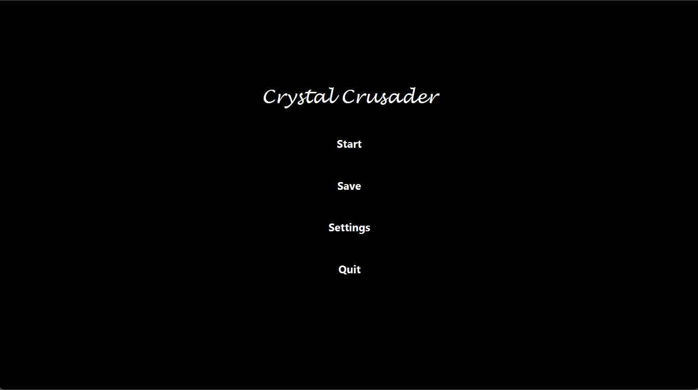
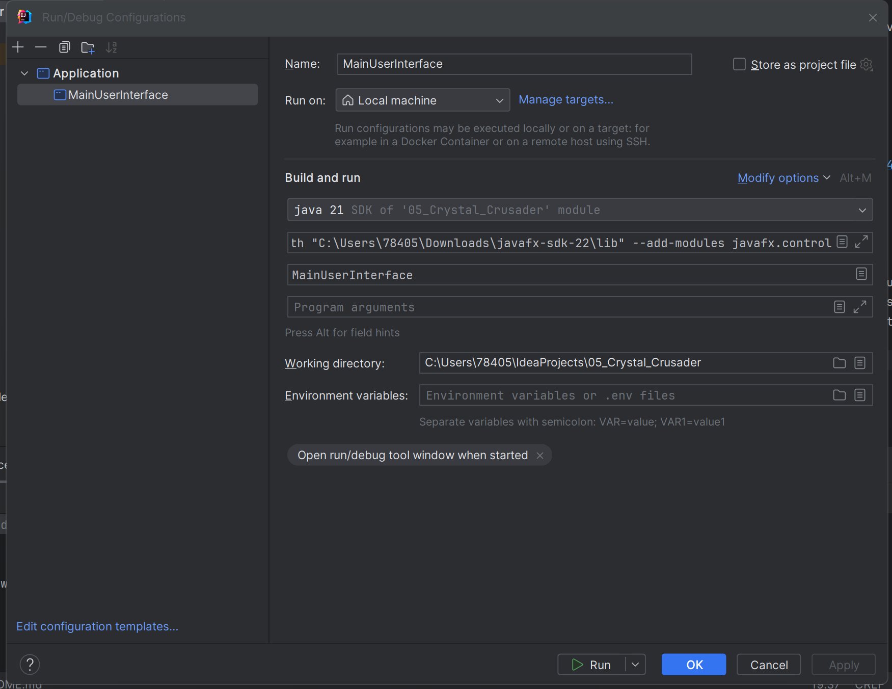

# Crystal Crusader 
"Crystal Crusader" is all about creating your own hero, taking on enemies,finding unique items and diving into a world where crystals are powerful artifacts. If you're into strategic fights and stories where your choices matter, this is the game for you.
(we can add the relevant screenshot here later).




# How to contribute
Follow this project board to know the latest status of the project: https://github.com/orgs/cis3296s24/projects/80

### How to build and run (IntelliJ IDEA)
- Get the code from the repo: https://github.com/cis3296s24/05_Crystal_Crusader.git.
- Use the 'main' branch for a more stable release or development.
- Download the latest binary from the Release section on the right on GitHub.
- Open https://gluonhq.com/products/javafx/, download the JavaFX SDK and unzip it to a location on your computer. (Also unzip lib folder from the zip file if necessary)
- Open the project in IntelliJ IDEA and go to File -> Project Structure -> Libraries. Click on the + sign and add the path to the lib folder in the JavaFX SDK folder. Click Apply and then OK.
- Go to Run -> Edit Configurations. Click on the + sign and add a new Application configuration. Set the Main class to be Main and set the VM options to 
```
--module-path "path to JavaFX lib folder"

--add-modules javafx.controls,javafx.fxml

--add-opens javafx.base/com.sun.javafx=ALL-UNNAMED

--add-opens javafx.graphics/com.sun.glass.utils=ALL-UNNAMED

--add-opens javafx.graphics/com.sun.javafx.tk=ALL-UNNAMED
```
- Click Apply and then OK.(Remember to replace "path to JavaFX lib folder" with the actual path to the lib folder in the JavaFX SDK folder)
- It should look like this:
  
- Click Run.
